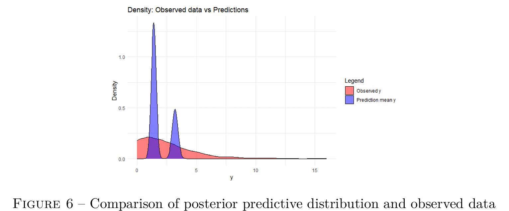
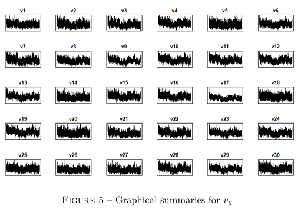
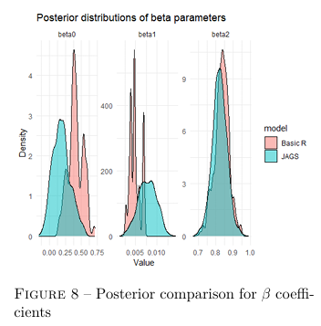

# Bayesian Hierarchical Modeling of Hospital Visits

A Bayesian hierarchical Poisson regression model implemented in **R** and **JAGS** to analyze hospital visit counts while accounting for hospital-level heterogeneity through random effects.

## Project Overview

This project develops a hierarchical Bayesian framework for modeling hospital visit counts. The model incorporates both patient-level covariates and hospital-specific random effects, allowing for a flexible representation of variability across healthcare institutions.

The project includes:

- Mathematical derivation of the hierarchical Bayesian model
- Custom Metropolis-within-Gibbs MCMC implementation in R
- Posterior inference and convergence diagnostics
- Posterior predictive evaluation
- Validation against JAGS
- Sensitivity analysis to prior specification

---

## Repository Structure

```text
.
├── code/
│   └── Bayes_code.R
│
├── data/
│   └── HospitalVisits.txt
│
├── figures/
│   ├── MCMC_Traceplots.png
│   ├── posterior_predictive.png
│   ├── random_effects.png
│   ├── jags_comparison_beta.png
│   └── jags_comparsion_hospital_effects.png
│
├── report/
│   └── Bayes_report.pdf
│
├── LICENSE
└── README.md
```

---

## Statistical Model

For patient *i* belonging to hospital *g(i)*:

\[
Y_i \sim \text{Poisson}(v_{g(i)} \exp(\eta_i))
\]

where

\[
\eta_i = \beta_0 + \beta_1 Age_i + \beta_2 Chronic_i
\]

### Prior Distributions

Regression coefficients:

\[
\beta_j \sim N(0,100)
\]

Hospital-specific effects:

\[
v_g \sim \text{Gamma}(\alpha,\alpha)
\]

Hyperparameter:

\[
\alpha \sim \text{Gamma}(a_0,b_0)
\]

---

## MCMC Implementation

A custom **Metropolis-within-Gibbs sampler** was developed in base R.

At each iteration:

1. Update regression coefficients (\(\beta\)) using Metropolis-Hastings.
2. Update hospital random effects (\(v_g\)) using Gibbs sampling.
3. Update hyperparameter (\(\alpha\)) using Metropolis-Hastings.

After burn-in, posterior samples are used for inference and prediction.

---

## MCMC Diagnostics

### Traceplots

The traceplots below show the behavior of the Markov chains for the model parameters.

<p align="center">
  
</p>

The chains exhibit acceptable convergence, although some regression coefficients display moderate autocorrelation and slow mixing.

---

## Posterior Predictive Performance

To assess model fit, posterior predictive samples were compared with the observed hospital visit counts.

<p align="center">
  
</p>

### Key Findings

- The model accurately captures the central tendency of the data.
- Variability is slightly underestimated.
- Extreme observations are not fully represented.
- Evidence of residual heterogeneity remains.

---

## Hospital-Level Random Effects

The hierarchical structure captures variability among hospitals through hospital-specific random effects.

<p align="center">
  
</p>

The posterior distributions reveal substantial differences across hospitals, supporting the inclusion of a hierarchical component.

---

## Validation Using JAGS

The model was independently implemented in **JAGS** using the `rjags` package.

### Comparison of Fixed Effects

<p align="center">
  
</p>

### Comparison of Hospital Effects

<p align="center">
  
</p>

Both implementations produce similar posterior distributions and hospital-level patterns, providing validation of the custom MCMC algorithm.

---

## Posterior Summary

| Parameter | Mean | SD | 95% Credible Interval |
|-----------|------|------|----------------------|
| β₀ | 0.409 | 0.116 | [0.189, 0.604] |
| β₁ | 0.005 | 0.001 | [0.003, 0.007] |
| β₂ | 0.834 | 0.041 | [0.749, 0.914] |
| α | 2.454 | 0.650 | [1.412, 3.901] |

### Interpretation

- **β₁** indicates a small positive effect of age on hospital visits.
- **β₂** shows a strong positive effect associated with chronic conditions.
- **α** suggests moderate variability across hospitals.
- Hospital-level effects capture heterogeneity beyond a standard Poisson model.

---

## Model Comparison

A simpler non-hierarchical Poisson model was also evaluated.

| Model | DIC |
|---------|---------|
| Simple Poisson | 3132.7 |
| Hierarchical Poisson | 3792.1 |

Although the hierarchical model captures hospital heterogeneity, the simpler model achieved a lower DIC and was preferred according to this criterion.

---

## Requirements

Required R packages:

```r
install.packages(c(
  "coda",
  "rjags",
  "MASS",
  "ggplot2"
))
```

---

## Running the Project

Clone the repository:

```bash
git clone https://github.com/Mateus-Auza/bayesian-hospital-visits.git
cd bayesian-hospital-visits
```

Run the analysis:

```r
source("code/Bayes_code.R")
```

---

## Full Report

A complete description of the model derivation, MCMC implementation, posterior analysis, predictive assessment, robustness study, and JAGS comparison can be found in:

```text
report/Bayes_report.pdf
```

---

## Authors

**Mateus Auza Cruz**

**Belanov Bogning Tatchinda**

---

## License

This project is licensed under the terms specified in the LICENSE file.


